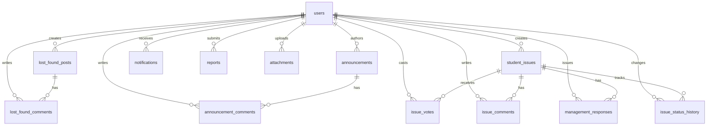

# Student Portal Database Documentation

This document describes the database design, entity relationships, indexes, constraints, and migration strategies for the **Student Portal Database Layer**.

---

## 1. Entity Relationship (ER) Diagram



---

## 2. Table Specifications & Data Dictionary

### Core Tables
1. **`users`**: Stores authenticated portal accounts across all 4 system roles (`STUDENT`, `REPRESENTATIVE`, `MANAGEMENT`, `ADMIN`).
2. **`lost_found_posts`**: Posts representing lost or found personal items across campus.
3. **`lost_found_comments`**: Discussion comments on lost/found posts.
4. **`announcements`**: Broadcast messages posted by Management or Admin users with priority flags (`NORMAL`, `IMPORTANT`, `URGENT`, `OFFICIAL_CLARIFICATION`).
5. **`announcement_comments`**: Q&A/Discussion comments on official announcements.
6. **`student_issues`**: Suggestions or issues submitted by Student Representatives or Students across categories (e.g., `HOSTEL`, `INFRASTRUCTURE`, `CANTEEN`).
7. **`issue_votes`**: Records upvotes cast by students on issues. Protected by constraint `CONSTRAINT "unique_issue_user_vote" UNIQUE ("issueId", "userId")`.
8. **`issue_comments`**: Comments on student issues.
9. **`management_responses`**: Official responses posted by Management/Admin accounts.
10. **`issue_status_history`**: Audit trail of issue status changes (`SUBMITTED` → `UNDER_REVIEW` → `IN_PROGRESS` → `RESOLVED`).
11. **`notifications`**: User-specific inbox notifications triggered by system events.
12. **`reports`**: Moderation reports submitted by users for inappropriate posts, comments, or issues.
13. **`attachments`**: Uploaded media/document files associated with posts, issues, or announcements.
14. **`system_settings`**: Key-value pairs for configurable threshold values (e.g., `student_issue_upvote_threshold = 100`).

---

## 3. Key Constraints & Data Integrity

- **Unique Vote Guarantee:** The `issue_votes` table has a database-level composite unique constraint: `UNIQUE ("issueId", "userId")`. This prevents any user from casting multiple votes for the same issue, regardless of application layer behavior.
- **Unique User Emails:** `users.email` is defined as `UNIQUE` to prevent account duplication.
- **Foreign Key Cascades:** Comments and votes maintain `ON DELETE CASCADE` on their parent posts/issues, while primary user references use `ON DELETE RESTRICT` to preserve historical integrity.

---

## 4. Indexing Strategy

Indexes are created for high-frequency search and query patterns:
- **Search & Filter:** `lost_found_posts(status, category, createdAt)`, `student_issues(status, category, upvoteCount, createdAt)`.
- **Priority Feeds:** `announcements(priority, createdAt)`.
- **Notification Inbox:** `notifications(userId, isRead, createdAt)`.

---

## 5. Instructions & Execution

### Applying the Schema (PostgreSQL)
Run the DDL script in your PostgreSQL database instance:
```bash
psql -U postgres -d student_portal -f database/schema.sql
```

### Seeding Development Data
Run the seed script to populate test users, posts, announcements, and issues:
```bash
psql -U postgres -d student_portal -f database/seed.sql
```
